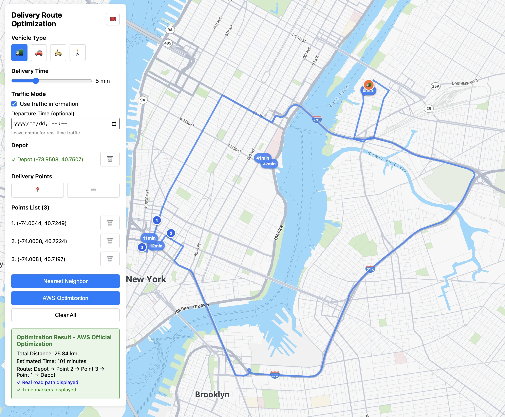

# AWS Location 快递路径规划 MVP

基于 AWS Location Service 的最小化快递路径规划应用。



## 功能特性

- 🗺️ 交互式地图界面
- 🚛 多种车辆类型支持（卡车、汽车、电动车、步行）
- 📍 点击地图设置配送中心和配送点
- 🔄 最近邻算法路径优化
- ⏱️ 实时显示路段时间
- 📊 优化结果统计

## 快速开始

### 1. 安装依赖

```bash
npm install
```

### 2. 配置环境变量

复制环境变量模板文件：
```bash
cp .env.example .env
```

然后编辑 `.env` 文件，填入你的 AWS Location Service API Key：
```bash
VITE_AWS_API_KEYS=your-aws-location-api-key-here
```

可选：自定义地图中心位置（默认：美国纽约）：
```bash
VITE_MAP_CENTER_LONGITUDE=-74.006
VITE_MAP_CENTER_LATITUDE=40.7128
VITE_MAP_INITIAL_ZOOM=12
```

### 3. 启动开发服务器

```bash
npm run dev
```

访问 http://localhost:3000

## 使用方法

1. **选择车辆类型** - 点击车辆类型按钮选择配送车辆
2. **设置配送中心** - 点击"设置配送中心"按钮，然后在地图上点击位置
3. **添加配送点** - 点击"添加配送点"按钮，连续在地图上点击添加多个配送点
4. **路径优化** - 点击"开始路径优化"按钮计算最优路径
5. **查看结果** - 地图上显示优化后的路径，包含时间标记和统计信息

## 技术栈

- React 18 + TypeScript
- Vite
- MapLibre GL JS
- AWS SDK for JavaScript (Geo Routes)
- AWS Location Service

## 项目结构

```
src/
├── App.tsx          # 主应用组件
├── main.tsx         # 应用入口
└── index.css        # 样式文件
```

## AWS Location Service 配置

确保你的 AWS Location Service 已配置：

1. 创建 API Key
2. 设置适当的权限
3. 确保 API Key 有访问 Routes API 的权限

## 构建部署

```bash
npm run build
```

构建产物在 `dist/` 目录中。
